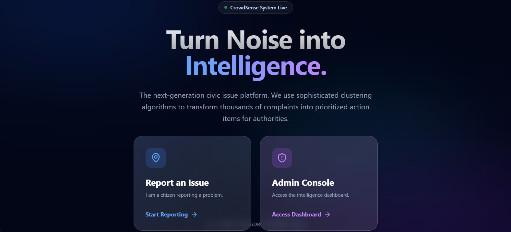

# 🚀 CROWDSENSE

**CROWDSENSE** is a MongoDB-powered web application built during a hack day to improve how urgent public issues are reported, categorized, and resolved.

The goal is simple:  
**sense problems early, prioritize them correctly, and fix them transparently.**

---

## 📸 Demo




> Add a screenshot, GIF, or short video of your app here to showcase the workflow.

---

## 🧠 What is CROWDSENSE?

CROWDSENSE is designed to **collect real-time data about nearby urgent issues**—such as infrastructure problems, safety concerns, or civic complaints—and **categorize them based on urgency levels**.

Administrators can then:
- Quickly identify critical issues
- Prioritize responses efficiently
- Track actions transparently

This creates a feedback loop where problems don’t just get reported—they get resolved.

---

## ✨ Key Features

- 📍 Report nearby urgent issues
- 🚨 Automatic categorization by urgency level
- 🗂️ Centralized admin dashboard
- 📊 Transparent issue tracking
- ⚡ Fast and scalable data handling using MongoDB

---

## 🛠️ Tech Stack

- **Backend:** Node.js / Express  
- **Database:** MongoDB  
- **Frontend:** HTML, CSS, JavaScript *(or React — update if applicable)*  
- **Deployment:** Cloud-hosted (Hack Day Deployment)

---

## ⚙️ Installation & Setup

Clone the repository:
```bash
git clone https://github.com/your-username/crowdsense.git
